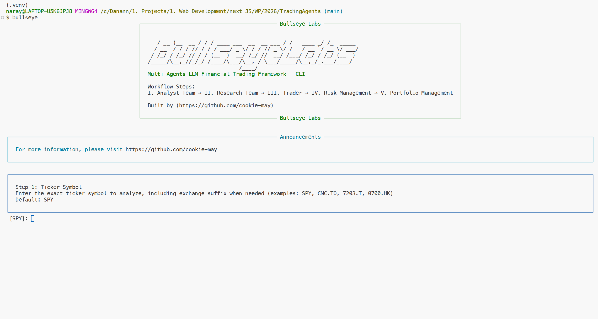
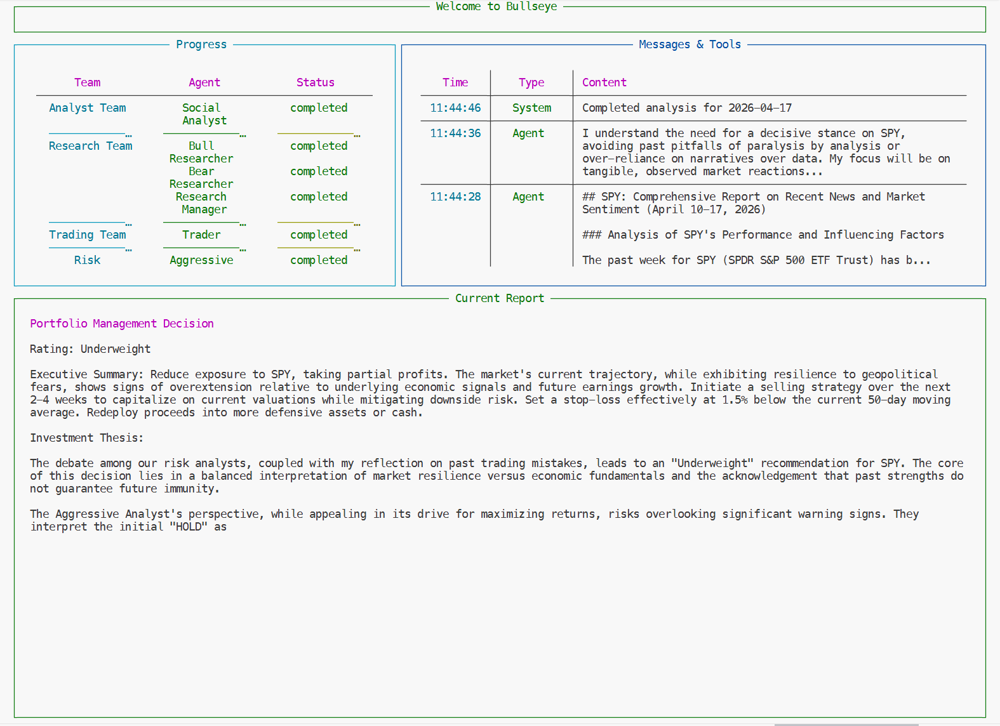
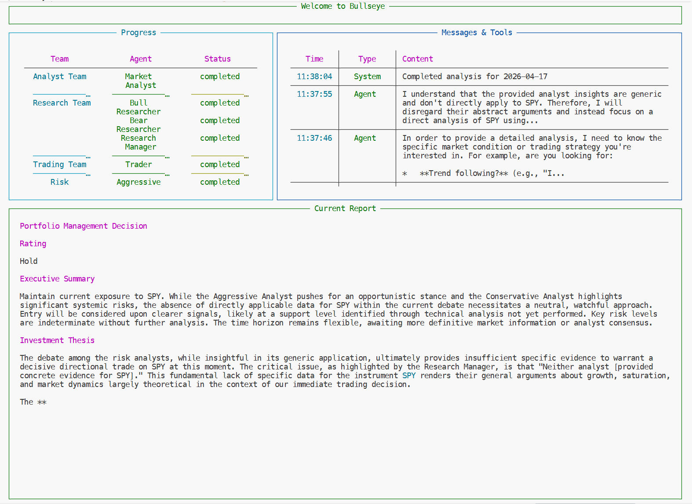

<p align="center">
  
</p>

<div align="center" style="line-height: 1;">
  <a href="https://arxiv.org/abs/2412.20138" target="_blank"></a>
  <a href="https://discord.com/invite/hk9PGKShPK" target="_blank"></a>
  <a href="./assets/wechat.png" target="_blank"></a>
  <a href="https://x.com/cookie-may" target="_blank"></a>
  <br>
  <a href="https://github.com/cookie-may/" target="_blank"></a>
</div>

<div align="center">
  <!-- Keep these links. Translations will automatically update with the README. -->
  <a href="https://www.readme-i18n.com/cookie-may/Bullseye?lang=de">Deutsch</a> | 
  <a href="https://www.readme-i18n.com/cookie-may/Bullseye?lang=es">Español</a> | 
  <a href="https://www.readme-i18n.com/cookie-may/Bullseye?lang=fr">français</a> | 
  <a href="https://www.readme-i18n.com/cookie-may/Bullseye?lang=ja">日本語</a> | 
  <a href="https://www.readme-i18n.com/cookie-may/Bullseye?lang=ko">한국어</a> | 
  <a href="https://www.readme-i18n.com/cookie-may/Bullseye?lang=pt">Português</a> | 
  <a href="https://www.readme-i18n.com/cookie-may/Bullseye?lang=ru">Русский</a> | 
  <a href="https://www.readme-i18n.com/cookie-may/Bullseye?lang=zh">中文</a>
</div>

---

# Bullseye: Multi-Agents LLM Financial Trading Framework

## News
- [2026-03] **Bullseye v0.2.3** released with multi-language support, GPT-5.4 family models, unified model catalog, backtesting date fidelity, and proxy support.
- [2026-03] **Bullseye v0.2.2** released with GPT-5.4/Gemini 3.1/Claude 4.6 model coverage, five-tier rating scale, OpenAI Responses API, Anthropic effort control, and cross-platform stability.
- [2026-02] **Bullseye v0.2.0** released with multi-provider LLM support (GPT-5.x, Gemini 3.x, Claude 4.x, Grok 4.x) and improved system architecture.
- [2026-01] **Trading-R1** [Technical Report](https://arxiv.org/abs/2509.11420) released, with [Terminal](https://github.com/cookie-may/Trading-R1) expected to land soon.


> 🎉 **Bullseye** officially released! We have received numerous inquiries about the work, and we would like to express our thanks for the enthusiasm in our community.
>
> So we decided to fully open-source the framework. Looking forward to building impactful projects with you!

<div align="center">

🚀 [Bullseye](#bullseye-framework) | ⚡ [Installation & CLI](#installation-and-cli) | 📦 [Package Usage](#bullseye-package) | 🤝 [Contributing](#contributing) | 📄 [Citation](#citation)

</div>

## Bullseye Framework

Bullseye is a multi-agent trading framework that mirrors the dynamics of real-world trading firms. By deploying specialized LLM-powered agents: from fundamental analysts, sentiment experts, and technical analysts, to trader, risk management team, the platform collaboratively evaluates market conditions and informs trading decisions. Moreover, these agents engage in dynamic discussions to pinpoint the optimal strategy.

<p align="center">
  
</p>

> Bullseye framework is designed for research purposes. Trading performance may vary based on many factors, including the chosen backbone language models, model temperature, trading periods, the quality of data, and other non-deterministic factors. [It is not intended as financial, investment, or trading advice.](https://cookie-may.ai/disclaimer/)

Our framework decomposes complex trading tasks into specialized roles. This ensures the system achieves a robust, scalable approach to market analysis and decision-making.

### Analyst Team
- Fundamentals Analyst: Evaluates company financials and performance metrics, identifying intrinsic values and potential red flags.
- Sentiment Analyst: Analyzes social media and public sentiment using sentiment scoring algorithms to gauge short-term market mood.
- News Analyst: Monitors global news and macroeconomic indicators, interpreting the impact of events on market conditions.
- Technical Analyst: Utilizes technical indicators (like MACD and RSI) to detect trading patterns and forecast price movements.

<p align="center">
  
</p>

### Researcher Team
- Comprises both bullish and bearish researchers who critically assess the insights provided by the Analyst Team. Through structured debates, they balance potential gains against inherent risks.

<p align="center">
  
</p>

### Trader Agent
- Composes reports from the analysts and researchers to make informed trading decisions. It determines the timing and magnitude of trades based on comprehensive market insights.

<p align="center">
  
</p>

### Risk Management and Portfolio Manager
- Continuously evaluates portfolio risk by assessing market volatility, liquidity, and other risk factors. The risk management team evaluates and adjusts trading strategies, providing assessment reports to the Portfolio Manager for final decision.
- The Portfolio Manager approves/rejects the transaction proposal. If approved, the order will be sent to the simulated exchange and executed.

<p align="center">
  
</p>

## Installation and CLI

### Installation

Clone Bullseye:
```bash
git clone https://github.com/cookie-may/Bullseye.git
cd Bullseye
```

Create a virtual environment in any of your favorite environment managers:
```bash
conda create -n bullseye python=3.13
conda activate bullseye
```

Install the package and its dependencies:
```bash
pip install .
```

### Docker

Alternatively, run with Docker:
```bash
cp .env.example .env  # add your API keys
docker compose run --rm bullseye
```

For local models with Ollama:
```bash
docker compose --profile ollama run --rm bullseye-ollama
```

### Required APIs

Bullseye supports multiple LLM providers. Set the API key for your chosen provider:

```bash
export OPENAI_API_KEY=...          # OpenAI (GPT)
export GOOGLE_API_KEY=...          # Google (Gemini)
export ANTHROPIC_API_KEY=...       # Anthropic (Claude)
export XAI_API_KEY=...             # xAI (Grok)
export DEEPSEEK_API_KEY=...        # DeepSeek
export DASHSCOPE_API_KEY=...       # Qwen (Alibaba DashScope)
export ZHIPU_API_KEY=...           # GLM (Zhipu)
export OPENROUTER_API_KEY=...      # OpenRouter
export ALPHA_VANTAGE_API_KEY=...   # Alpha Vantage
```

For enterprise providers (e.g. Azure OpenAI, AWS Bedrock), copy `.env.enterprise.example` to `.env.enterprise` and fill in your credentials.

For local models, configure Ollama with `llm_provider: "ollama"` in your config.

Alternatively, copy `.env.example` to `.env` and fill in your keys:
```bash
cp .env.example .env
```

### CLI Usage

Launch the interactive CLI:
```bash
bullseye          # installed command
python -m cli.main     # alternative: run directly from source
```
You will see a screen where you can select your desired tickers, analysis date, LLM provider, research depth, and more.

<p align="center">
  
</p>

An interface will appear showing results as they load, letting you track the agent's progress as it runs.

<p align="center">
  
</p>

<p align="center">
  
</p>

## Bullseye Package

### Implementation Details

We built Bullseye with LangGraph to ensure flexibility and modularity. The framework supports multiple LLM providers: OpenAI, Google, Anthropic, xAI, OpenRouter, and Ollama.

### Python Usage

To use Bullseye inside your code, you can import the `bullseye` module and initialize a `BullseyeGraph()` object. The `.propagate()` function will return a decision. You can run `main.py`, here's also a quick example:

```python
from bullseye.graph.trading_graph import BullseyeGraph
from bullseye.default_config import DEFAULT_CONFIG

ta = BullseyeGraph(debug=True, config=DEFAULT_CONFIG.copy())

# forward propagate
_, decision = ta.propagate("NVDA", "2026-01-15")
print(decision)
```

You can also adjust the default configuration to set your own choice of LLMs, debate rounds, etc.

```python
from bullseye.graph.trading_graph import BullseyeGraph
from bullseye.default_config import DEFAULT_CONFIG

config = DEFAULT_CONFIG.copy()
config["llm_provider"] = "openai"        # openai, google, anthropic, xai, openrouter, ollama
config["deep_think_llm"] = "gpt-5.4"     # Model for complex reasoning
config["quick_think_llm"] = "gpt-5.4-mini" # Model for quick tasks
config["max_debate_rounds"] = 2

ta = BullseyeGraph(debug=True, config=config)
_, decision = ta.propagate("NVDA", "2026-01-15")
print(decision)
```

See `bullseye/default_config.py` for all configuration options.

## Contributing

We welcome contributions from the community! Whether it's fixing a bug, improving documentation, or suggesting a new feature, your input helps make this project better. If you are interested in this line of research, please consider joining our open-source financial AI research community [cookie-may](https://cookie-may.ai/).

## Citation

Please reference our work if you find *Bullseye* provides you with some help :)

```
@misc{xiao2025bullseyemultiagentsllmfinancial,
      title={Bullseye: Multi-Agents LLM Financial Trading Framework}, 
      author={Yijia Xiao and Edward Sun and Di Luo and Wei Wang},
      year={2025},
      eprint={2412.20138},
      archivePrefix={arXiv},
      primaryClass={q-fin.TR},
      url={https://arxiv.org/abs/2412.20138}, 
}
```
